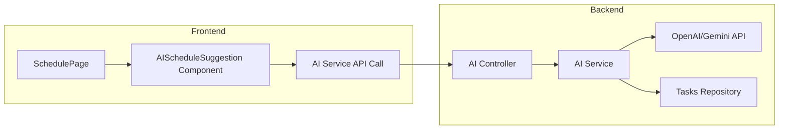

# AI Smart Scheduling - Gợi ý lịch làm việc thông minh

## Mô tả tính năng

Tích hợp AI vào trang **Lịch làm việc** để:
1. **Gợi ý lịch làm việc hôm nay** - AI phân tích tasks và đề xuất thứ tự ưu tiên
2. **Sắp xếp lịch thông minh** - AI gợi ý reschedule khi có conflict hoặc overload
3. **Cảnh báo deadline** - AI nhắc nhở tasks sắp đến hạn

---

## User Review Required

> [!IMPORTANT]
> **Chọn AI Provider**: Bạn muốn sử dụng AI nào?
> - **OpenAI GPT-4o/GPT-4o-mini** - Tốt nhất, có phí (~$0.01/request)
> - **Google Gemini 1.5 Flash** - Miễn phí, nhanh
> - **Self-hosted LLM** - Cần setup riêng

> [!WARNING]
> **API Key cần thiết**: Bạn cần cung cấp API key để tích hợp AI. Key sẽ được lưu trong file `.env` của backend.

---

## Kiến trúc hệ thống



---

## Proposed Changes

### Backend - AI Module

#### [NEW] [ai.module.ts](file:///d:/Hoc/QLDA/be/src/ai/ai.module.ts)
Module mới để quản lý AI integration

#### [NEW] [ai.service.ts](file:///d:/Hoc/QLDA/be/src/ai/ai.service.ts)
Service xử lý logic AI:
```typescript
// Các chức năng chính:
- suggestDailySchedule(userId: string, date: Date) 
  → Gợi ý lịch làm việc trong ngày
  
- suggestReschedule(userId: string, tasks: Task[])
  → Gợi ý sắp xếp lại khi có conflict
  
- analyzeWorkload(userId: string, dateRange: DateRange)
  → Phân tích workload và cảnh báo
```

#### [NEW] [ai.controller.ts](file:///d:/Hoc/QLDA/be/src/ai/ai.controller.ts)
REST endpoints:
```
POST /api/ai/suggest-schedule
POST /api/ai/suggest-reschedule  
GET  /api/ai/workload-analysis
```

#### [MODIFY] [app.module.ts](file:///d:/Hoc/QLDA/be/src/app.module.ts)
Import AIModule vào app

#### [MODIFY] [.env](file:///d:/Hoc/QLDA/be/.env)
Thêm biến môi trường:
```env
OPENAI_API_KEY=sk-xxx
# hoặc
GEMINI_API_KEY=xxx
```

---

### Frontend - AI Components

#### [NEW] [ai.service.ts](file:///d:/Hoc/QLDA/qlda-fe/src/services/ai.service.ts)
API service để gọi AI endpoints

#### [NEW] [AIScheduleSuggestion.tsx](file:///d:/Hoc/QLDA/qlda-fe/src/pages/schedule/components/AIScheduleSuggestion.tsx)
Component hiển thị gợi ý AI:
- Card với tiêu đề "Gợi ý từ AI"
- Danh sách tasks được sắp xếp theo thứ tự ưu tiên
- Lý do cho mỗi gợi ý
- Nút "Áp dụng gợi ý" / "Làm mới"

#### [MODIFY] [index.tsx](file:///d:/Hoc/QLDA/qlda-fe/src/pages/schedule/index.tsx)
Tích hợp AIScheduleSuggestion component vào trang Schedule

---

## Chi tiết UI/UX

### Vị trí hiển thị
```
┌─────────────────────────────────────────────┐
│  Lịch làm việc                              │
├─────────────────────────────────────────────┤
│  [Tổng quan công việc - Stats hiện tại]     │
├─────────────────────────────────────────────┤
│  🤖 GỢI Ý LỊCH LÀM VIỆC HÔM NAY            │  ← NEW
│  ┌─────────────────────────────────────────┐│
│  │ 1. Task A (High) - Deadline hôm nay    ││
│  │    💡 Ưu tiên vì deadline gấp          ││
│  │ 2. Task B (Medium) - Cần 2h            ││
│  │    💡 Nên làm buổi sáng khi tập trung  ││
│  │ 3. Task C (Low) - Có thể dời           ││
│  │    💡 Có thể làm sau nếu hết thời gian ││
│  └─────────────────────────────────────────┘│
│  [🔄 Làm mới] [✅ Áp dụng gợi ý]            │
├─────────────────────────────────────────────┤
│  [Calendar View / Day View - hiện tại]      │
└─────────────────────────────────────────────┘
```

### Prompt AI mẫu
```
Bạn là trợ lý lập kế hoạch công việc cho sinh viên.

NHIỆM VỤ: Sắp xếp các task sau theo thứ tự ưu tiên để làm trong ngày hôm nay.

CONTEXT:
- Ngày hiện tại: {currentDate}
- Giờ hiện tại: {currentTime}
- Thời gian làm việc: 8:00 - 22:00

DANH SÁCH TASKS:
{tasks.map(t => `
- ${t.title}
  + Priority: ${t.priority}
  + Deadline: ${t.dueDate}
  + Status: ${t.status}
  + Estimated time: ${t.estimatedTime || 'unknown'}
`)}

YÊU CẦU:
1. Sắp xếp theo thứ tự nên làm từ sáng đến tối
2. Giải thích ngắn gọn lý do cho mỗi task
3. Cảnh báo nếu có task không kịp deadline
4. Đề xuất task nào có thể dời sang ngày khác

RESPONSE FORMAT (JSON):
{
  "suggestions": [
    {
      "taskId": "xxx",
      "order": 1,
      "suggestedStartTime": "09:00",
      "reason": "Deadline hôm nay, cần làm ngay"
    }
  ],
  "warnings": ["Task X có thể không kịp deadline"],
  "summary": "Có 5 task cần làm hôm nay, ưu tiên 2 task deadline gấp"
}
```

---

## Verification Plan

### Automated Tests

Không có test tự động sẵn cho AI module vì đây là module hoàn toàn mới. Sẽ thêm unit tests sau khi implement.

### Manual Verification

1. **Test Backend API**
   - Khởi động backend: `cd be && yarn dev`
   - Dùng Postman/curl gọi API:
     ```bash
     curl -X POST http://localhost:3000/api/ai/suggest-schedule \
       -H "Authorization: Bearer <token>" \
       -H "Content-Type: application/json" \
       -d '{"date": "2026-01-10"}'
     ```
   - Verify response trả về JSON với suggestions

2. **Test Frontend UI**
   - Mở http://localhost:5173/schedule
   - Kiểm tra component AI Suggestion hiển thị
   - Click "Làm mới" → verify gọi API và hiển thị kết quả
   - Verify loading state hoạt động đúng

3. **Test Integration**
   - Tạo vài tasks với deadline khác nhau
   - Vào trang Schedule → verify AI gợi ý hợp lý
   - Test với ngày không có task → verify hiển thị message phù hợp

---

## Ước tính thời gian

| Phần | Thời gian |
|------|-----------|
| Backend AI Module | 2-3 giờ |
| Frontend Component | 2-3 giờ |
| Testing & Polish | 1-2 giờ |
| **Tổng** | **5-8 giờ** |

---

## Câu hỏi cần xác nhận

1. **AI Provider**: Bạn muốn dùng OpenAI hay Gemini?
2. **API Key**: Bạn đã có API key chưa?
3. **Scope**: Bạn muốn làm đầy đủ 3 tính năng hay bắt đầu với "Gợi ý lịch hôm nay" trước?
